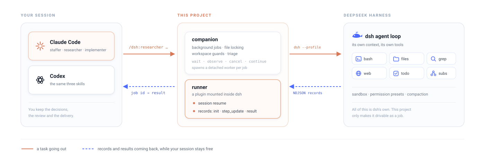
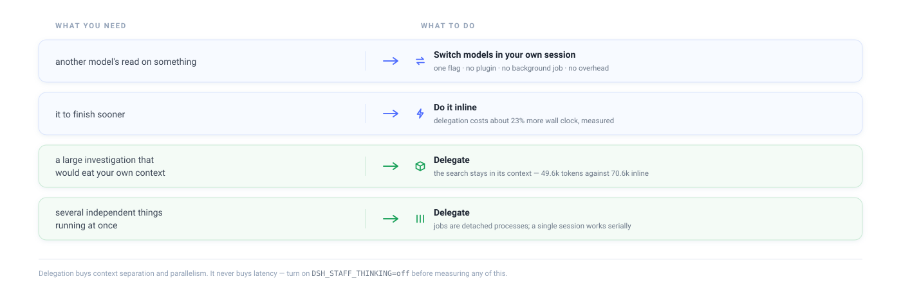

<div align="center">

# dsh-staff

**Hand a task to DeepSeek Harness and get on with something else.**

Delegate work from inside Claude Code or Codex to a background [`dsh`](https://github.com/deepseek-ai/deepseek-harness) agent — running in its own context, with its own tools, reporting progress as it goes.

[](https://github.com/HuntercodeT/dsh-staff/actions/workflows/consistency.yml)
[](LICENSE)
[](#install)
[](#install)
[](docs/BENCHMARK.md)

[Install](#install) · [Usage](#working-with-jobs) · [Configuration](#configuration) · [Speed](#speed) · [Benchmark](docs/BENCHMARK.md) · [中文测评](docs/BENCHMARK.zh-CN.md)

<picture>
  <source media="(prefers-color-scheme: dark)" srcset="assets/architecture-dark.svg">
  
</picture>

</div>

---

```console
$ /dsh:researcher survey how session resume is wired through this repo

Started background research job.
job id: research-muf88u1c-236a3811 (pid 41207)
model: deepseek-flash  profile: unrestricted  timeout: 60m
Collect: run `wait research-muf88u1c-236a3811 --timeout 10m`

$ wait research-muf88u1c-236a3811 --timeout 10m
# Job research-muf88u1c-236a3811 (research, done)

## Summary
The runner decides in a single ternary in run() — runner/index.mjs:235 …

[dsh-staff] mode=research model=deepseek-flash dsh_status=SUCCESS duration=154s
```

The job reads code, runs commands, and writes its answer to a file. Your session is not blocked, and its context is not spent on the search: on one measured task, delegating cost **49.6k** orchestrator tokens against **70.6k** doing the same work inline.

**What delegation is actually for.** The agent does its searching inside its own context — every file it opened, every command it ran, every dead end. What crosses back into your session is the answer. That is the one benefit these measurements confirm, and it grows with the size of the investigation. The other is parallelism: jobs are detached processes, so several run at once while a single session works serially.

> [!IMPORTANT]
> **Delegation does not make things faster.** It costs about **23% more wall clock** than working in your own session. What it buys is context headroom and parallelism. If you want speed — or just a second model's opinion — switch models in your own session instead. That is one flag, with none of this machinery.

## Install

```bash
npm i -g @deepseek-ai/dsh          # global, not npx — npx re-resolves on every call (~3s each)
export DEEPSEEK_API_KEY=<your key>
```

This repo is a plugin marketplace for both hosts:

```bash
# Claude Code
claude plugin marketplace add /path/to/dsh-staff
claude plugin install dsh@dsh-staff

# Codex
codex plugin marketplace add /path/to/dsh-staff
codex plugin add dsh@dsh-staff
```

Provision the dsh profile once, then smoke-test the whole chain:

```bash
node companion/dsh-companion.mjs setup
node companion/dsh-companion.mjs ask --prompt "Reply with exactly: ok"
```

If that prints `ok`, you are done. `setup` creates a `dsh-staff` profile under `$DSH_HOME/profiles/`, installs the runner and its overlay, and reports whether your key is visible.

> [!NOTE]
> Re-run `setup` after every upgrade — the runner lives inside that profile, so a new version changes nothing until it is reinstalled.

> [!WARNING]
> **In Codex, run unsandboxed.** dsh needs `$DSH_HOME`, the network, and the working directory; the default command sandbox hides at least one. Use `codex exec --dangerously-bypass-approvals-and-sandbox`, or approve with escalated permissions interactively.

## The three personas

| | for | notes |
|---|---|---|
| 🧩 `staffer` | anything the other two do not fit | minimal prompt — no role, no output format; the task text alone shapes the result |
| 🔍 `researcher` | surveys and deep dives | gathers its own evidence, returns a structured report |
| 🔧 `implementer` | changes to the working tree | the companion reports the git delta with the result and tells the caller to inspect it |

All three run in the background. An internal `ask` mode — tool-free, foreground — exists mainly to smoke-test the chain.

## Working with jobs

Dispatching returns a job id immediately.

| command | does |
|---|---|
| `wait <id> --timeout 10m` | block until done — **exit 0** result printed, **exit 2** still running |
| `result <id>` | the finished output |
| `observe <id>` | progress snapshot: recent tool calls, latest text |
| `cancel <id>` | stop it and clean up the process tree |
| `continue --job <id>` | follow up in the same conversation |
| `restart <id>` | re-run with a fresh budget, keeping the old record |

Progress is a real projection, not a spinner — the runner streams one record per tool call and per assistant message, so `observe` returns the last five invocations with input and output excerpts, bounded to 8 KiB so a runaway job cannot flood your context.

Timeouts are handled rather than swallowed: a job that hits its limit after producing text delivers that text with a warning; one that produces nothing reports `attention` with the conversation id, the last snapshot, and an exact command to continue.

In a host session you normally reach all of this through the `jobs` skill instead of typing commands.

## Configuration

All environment variables — there is no config file to learn.

```bash
export DEEPSEEK_API_KEY=<key>
export DEEPSEEK_BASE_URL=https://your-gateway/v1   # optional: any OpenAI-compatible endpoint
export DSH_STAFF_DEFAULT_MODEL=deepseek-flash      # whatever id your endpoint serves
export DSH_STAFF_THINKING=off                      # optional, see Speed
```

> [!TIP]
> **`DEEPSEEK_BASE_URL` must include the API path prefix.** dsh requests `${base}/chat/completions`, so a gateway under `/v1` needs `https://host/v1`. Point it at a bare host and you get `STREAM_CLOSED: SSE stream ended without [DONE]` — that is dsh parsing an HTML page as an event stream. It reads like a streaming bug and is not one.
>
> **Model ids belong to your endpoint.** The built-in per-persona defaults are DeepSeek's public ids; gateways often namespace them differently. Set `DSH_STAFF_DEFAULT_MODEL` once instead of passing `--model` every time.

### Permissions

Two profiles, mapped onto dsh's own presets — no separate allowlist to maintain.

| profile | dsh preset | approval | when |
|---|---|---|---|
| **unrestricted** *(default)* | `danger-full-access` | never | headless runs — nothing is present to answer a prompt |
| **restricted** | `workspace-write` | ask | to keep a mode from touching anything |

In a headless run nobody answers an approval, so under **restricted** the first tool call needing one yields an empty response. Neither profile is a sandbox for untrusted input — use an isolated checkout for that.

### Telemetry

dsh ships with OTEL session export to DeepSeek enabled. Because this is usually pointed at private repositories, the installed overlay disables that plugin and every run also sets `DSH_TELEMETRY_DISABLED=1`. Undo both to opt back in.

## Speed

The single biggest lever is turning off the model's reasoning phase:

```bash
export DSH_STAFF_THINKING=off
```

`deepseek-flash` reasons before every answer, and an agent loop pays that on **every round trip**. Measured on two task shapes, same endpoint, that flag the only variable:

| task | standalone | delegated |
|---|---|---|
| 🔍 research | 489s → **133s** *(−73%)* | 515s → **184s** *(−64%)* |
| 🔧 implement | 209s → **103s** *(−51%)* | 189s → **124s** *(−34%)* |

Quality held in every arm — identical citations on the research task, and on the coding task all four produced working code with the same structure, the reasoning-off runs if anything more thorough.

It is off by default because reasoning is how the model plans: keep it for work that needs judgement, drop it for mechanical steps. It is also the difference between delegation *appearing* to cost 3.4x and *actually* costing 23% — so turn it off before drawing any conclusion about delegation's overhead.

### Should you delegate at all?

<picture>
  <source media="(prefers-color-scheme: dark)" srcset="assets/decision-dark.svg">
  
</picture>

[docs/BENCHMARK.md](docs/BENCHMARK.md) ([中文](docs/BENCHMARK.zh-CN.md)) has the full comparison against running the same tasks inline, the control that separates model from harness, the quality checks, and one hypothesis that measured nothing — written up as such.

## Limitations

- **No working test suite.** `npm test` fails on purpose rather than pretending otherwise. The inherited suite under [`legacy-tests/`](legacy-tests/README.md) targets a file this fork renamed; porting the provider-agnostic half is the largest open piece of work here.
- **No schema-enforced output.** A structured-output request is carried in the prompt and is not enforced — dsh has no equivalent of a response schema.
- **dsh is a developer preview** whose maintainers expect compatibility-breaking changes. [`runner/index.mjs`](runner/index.mjs) depends on `agents.create`, `agents.resume`, and the `session/event` feed *by name*; a change to any of those breaks first.
- **Measurements here are single runs.** The same task under the same configuration has produced 163s and 269s. Useful for choosing how to work, not for citing.

## How it works

`setup` installs [`runner/index.mjs`](runner/index.mjs) into the dsh profile as a Cordis plugin, replacing dsh's own one-shot runner. The shipped runner mints a new session on every invocation and prints only the final assistant message — which leaves a delegation harness unable to continue a conversation or watch a long job. Both capabilities already exist in dsh core (`AgentRegistry.resume()` loads a persisted session; `session/event` is a live append feed); they are simply not exposed there. The replacement runner exposes them:

- **Session resume** — what makes `continue` and `restart` work.
- **A record stream**, `init` / `step_update` / `result` as NDJSON — what `observe`, `cancel`, and the timeout reporting read.

Everything else belongs to dsh: its tools, sandbox, permission presets, compaction, subagents. The companion (`companion/dsh-companion.mjs`) owns the job state machine, file locking, workspace guards, and the CLI.

## Contributing

[CONTRIBUTING.md](CONTRIBUTING.md) — setup, the traps that cost real debugging time, what CI can and cannot check, and what porting the test suite would involve.

## Credits and license

MIT. dsh-staff is a fork of [agy-staff](https://github.com/keli-wen/agy-staff) by Keli (pkuwkl), retargeted from Google's Antigravity CLI onto DeepSeek Harness. The job state machine, file locking, streaming worker, workspace observation, prompt templates, and CLI surface originate there; the dsh runner, provider layer, and profile overlay are original to this project. Both are MIT, and the upstream copyright notice is retained in [LICENSE](LICENSE).
